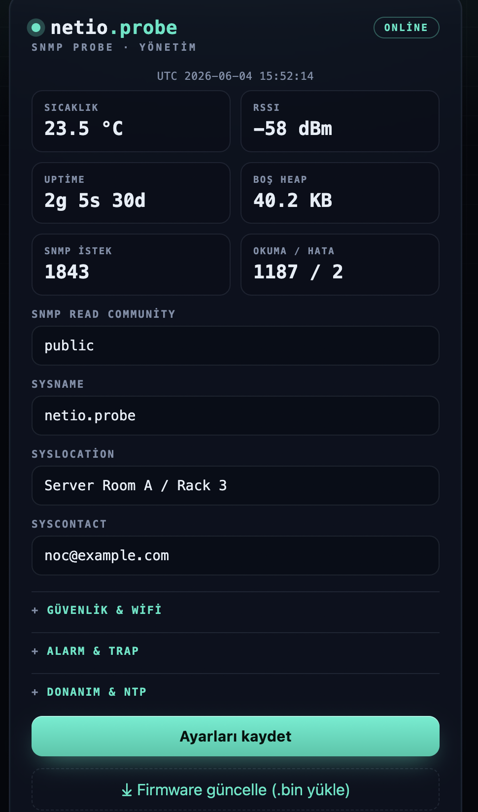

# netio.probe
 
**A self-contained SNMP v2c temperature probe for the ESP8266 + DS18B20 — zero external libraries.**
 
`netio.probe` turns a NodeMCU (ESP8266) and a single DS18B20 sensor into a proper, monitorable network device. It reads temperature over 1-Wire and publishes it as a **real SNMP v2c agent** (hand-written BER/ASN.1 — `snmpwalk` / `snmpget` work out of the box), exposes a **modern, password-protected web management UI**, supports **browser-based OTA** firmware updates, and ships a **first-boot Wi-Fi captive portal** so it can be provisioned without recompiling.
 
It is a self-alerting probe: configurable **temperature thresholds with hysteresis** drive an alarm state, an onboard **LED**, and **SNMP v2c traps** pushed to your NMS. As of **v1.4**, the **hardware pins, pull-up mode, and NTP** are all configurable from the web UI — no recompiling to move the sensor pin or sync the clock — on top of the v1.2 security/observability layer (source-IP ACL, salted-hash auth with brute-force lockout, Prometheus `/metrics`, remote syslog).
 
Everything depends only on the **ESP8266 Arduino Core** — no SNMP, OneWire, DallasTemperature, or crypto libraries required (SHA-256 uses the core's bundled BearSSL).
 


---


 
---
 
## Table of contents
 
- [What's new](#whats-new)
- [Features](#features)
- [How it works](#how-it-works)
- [Hardware](#hardware)
- [Build & flash](#build--flash)
- [Upgrading](#upgrading)
- [First-time setup (Wi-Fi captive portal)](#first-time-setup-wi-fi-captive-portal)
- [Web management interface](#web-management-interface)
- [Hardware & NTP configuration](#hardware--ntp-configuration)
- [Temperature alarms & SNMP traps](#temperature-alarms--snmp-traps)
- [Access control (ACL)](#access-control-acl)
- [Monitoring & integration](#monitoring--integration)
- [OTA firmware updates](#ota-firmware-updates)
- [Factory reset](#factory-reset)
- [SNMP usage](#snmp-usage)
- [OID map](#oid-map)
- [Configuration & defaults](#configuration--defaults)
- [Security considerations](#security-considerations)
- [Limitations & roadmap](#limitations--roadmap)
- [License](#license)
---
 
## What's new
 
### v1.4 — runtime hardware configuration & NTP
 
- **Configurable GPIO from the UI.** The **DS18B20 data pin**, the **internal/external pull-up** mode, and the **alarm LED/relay pin** are now runtime settings under **Hardware & NTP** — no recompiling to re-wire. The compile-time `#define`s are just the defaults. Pin/pull-up changes reboot the device so the 1-Wire bus re-initialises cleanly.
- **NTP time sync.** Set an NTP server (default `pool.ntp.org`, blank to disable). Once synced, **syslog messages carry a real RFC 5424 UTC timestamp** instead of the NILVALUE `-`, and the dashboard shows a live **UTC clock**.
- **Migration chain extended** — flashing v1.4 over **v1.1, v1.2, or v1.3** preserves settings.
### v1.3 — threshold-based alerting
 
- **Temperature thresholds + hysteresis** drive an alarm state (normal / high / low); hysteresis prevents flapping around the setpoint.
- **SNMP v2c traps** pushed to a configurable target (`IP:162`) on every alarm transition, carrying `sysUpTime.0`, `snmpTrapOID.0`, the temperature, and the alarm state.
- Onboard **LED alarm indicator**, a dashboard alarm banner, a `netio_alarm_state` metric, enterprise OIDs for alarm state and thresholds, and a **Test-trap** button (`/testtrap`).
### v1.2 — security, observability & reliability (recap)
 
- Admin password stored as **salt + SHA-256** (never plaintext); **per-IP brute-force lockout**.
- **Source-IP ACL (CIDR)** on SNMP, the web UI, and `/metrics`.
- **Prometheus `/metrics`** endpoint and **remote syslog** (RFC 5424 / UDP) for boot, config, OTA, sensor-fault, and **auth-failure** events.
- DS18B20 stuck-bus detection; **seamless EEPROM migration**; **watchdog + low-heap self-heal**; optional **MD5 verification** for web OTA.
---
 
## Features
 
- **Real SNMP v2c agent** — hand-written BER/ASN.1 encoder/decoder. Supports `GET`, `GETNEXT`, and `GETBULK` (single-repetition), so `snmpwalk` and `snmpbulkwalk` terminate correctly. Read-only; community is validated, and packets from outside the ACL or with a wrong community are dropped silently.
- **Threshold alarms + SNMP traps** — high/low thresholds with hysteresis, an alarm state machine, an LED indicator, and pushed `SNMPv2-Trap` notifications.
- **Runtime hardware config** — sensor pin, pull-up mode, and alarm-output pin set from the UI; **NTP** clock sync with UTC syslog timestamps.
- **Standards-aligned MIB** — full SNMPv2-MIB *System* group plus the **Entity Sensor MIB** (RFC 3433) for the temperature reading, plus an enterprise subtree with diagnostics (heap, RSSI, uptime, counters, alarm state, thresholds).
- **Prometheus `/metrics`** — telemetry plus alarm state in a format your monitoring stack scrapes directly.
- **Remote syslog** — security and operational events to a central collector (VictoriaLogs, ClickHouse, rsyslog, …), with UTC timestamps when NTP is enabled.
- **Hardened web UI** — HTTP Basic Auth backed by a **salted SHA-256** secret, **per-IP brute-force lockout**, and an optional **source-IP ACL**.
- **Robust DS18B20 driver** — standard 1-Wire timing with interrupts disabled only around the short reset/bit windows, a **non-blocking** conversion state machine, CRC8 validation, and stuck-bus detection.
- **First-boot Wi-Fi provisioning** — boots as an Access Point with a captive portal; pick your network from a live scan.
- **Browser OTA** — upload a compiled `.bin` from the web UI with a progress bar and optional MD5 check; classic IDE OTA (espota) also works.
- **Triple factory reset** — from the web UI, by shorting two pins, or via the FLASH button.
- **Single file, no dependencies** — drops straight into the Arduino IDE.
---
 
## How it works
 
```
power on
  └─► load config from EEPROM (magic + XOR checksum)
        │     • if a v1.1 / v1.2 / v1.3 layout is found, MIGRATE it (settings preserved)
        │
        ├─ configured AND Wi-Fi connects within 20 s ─► RUN MODE
        │     • SNMP agent            UDP/161   (ACL-filtered)
        │     • SNMP traps            UDP/162   (on alarm transitions)
        │     • Web management UI     TCP/80    (Basic Auth + ACL + lockout)
        │     • Prometheus metrics    /metrics  (ACL, no login)
        │     • Web OTA               /update   (auth + optional MD5)
        │     • IDE OTA (espota)      + mDNS
        │     • NTP sync              → UTC syslog timestamps
        │     • Remote syslog         UDP/514   (events)
        │     • Alarm LED             on threshold breach
        │
        └─ not configured OR connect fails ──────────► SETUP MODE
              • SoftAP "netio.probe-XXXX"  (WPA2)
              • captive portal at http://192.168.4.1/
              • live Wi-Fi scan, save → reboot into RUN
```
 
In RUN mode, if Wi-Fi stays down for more than 120 seconds the device reboots and falls back to the captive portal. Configuration is persisted in EEPROM as a single versioned struct guarded by a magic number and an XOR checksum; a watchdog and a low-heap guard reboot the device cleanly if it ever gets wedged.
 
---
 
## Hardware
 
### Bill of materials
 
| Qty | Part |
|----|------|
| 1 | ESP8266 board (NodeMCU 1.0 / ESP-12E) |
| 1 | DS18B20 temperature sensor |
| 1 | 4.7 kΩ resistor (1-Wire pull-up) |
| — | jumper wire (for factory-reset header, optional) |
 
### Wiring
 
| DS18B20 | ESP8266 (NodeMCU) |
|---------|-------------------|
| VDD | 3V3 |
| GND | GND |
| DATA | **GPIO4 (D2)** — default; changeable in the UI |
 
> ⚠️ **An external 4.7 kΩ pull-up between DATA and 3V3 is strongly recommended.** The ESP8266's internal pull-up (~30 kΩ+) is too weak for reliable 1-Wire timing, especially with Wi-Fi active. The internal pull-up can now be toggled from the UI (**Hardware & NTP → internal pull-up**) if you have no external resistor, but it is **not recommended**.
 
### Alarm output & factory-reset header
 
| Function | Pin |
|----------|-----|
| Alarm indicator | **`LED_BUILTIN`** by default (active-LOW) — re-assign to any GPIO in the UI for a relay/buzzer |
| Factory reset jumper | **GPIO14 (D5) ↔ GND** (short ~2 s) |
 
The alarm LED lights while the device is in a high or low temperature alarm. Shorting D5 to GND for ~2 seconds — at boot or at runtime — wipes all settings; the onboard FLASH button (GPIO0) held for 3 s does the same.
 
> **Safe data-pin choices:** GPIO **4, 5, 12, 13, 14**. Avoid GPIO0/2/15 (boot-strapping) and GPIO16 for 1-Wire.
 
---
 
## Build & flash
 
### Prerequisites
 
- **Arduino IDE** (or `arduino-cli`)
- **ESP8266 Arduino Core 3.x** — add this Boards Manager URL, then install "esp8266 by ESP8266 Community":
  ```
  https://arduino.esp8266.com/stable/package_esp8266com_index.json
  ```
- Board: **NodeMCU 1.0 (ESP-12E Module)**
- **No libraries to install** — everything used is part of the core (`ESP8266WiFi`, `ESP8266WebServer`, `DNSServer`, `ESP8266mDNS`, `WiFiUdp`, `ArduinoOTA`, `EEPROM`, `Updater`, the SNTP/`time.h` facility, and BearSSL for SHA-256).
### ⚠️ One sketch = one folder
 
The Arduino build concatenates **every `.ino` file in the sketch folder** into a single program. Keep exactly one `.ino`, and its name must match the folder:
 
```
netio_probe/
└── netio_probe.ino     ← the only .ino in this folder
```
 
If you see a wall of `redefinition of '...'` / `multiple definition of '...'` errors, you have more than one `.ino` (or an old copy) in the folder. Move/delete the extras so only `netio_probe.ino` remains.
 
### Steps
 
1. Put `netio_probe.ino` alone in a folder named `netio_probe`.
2. Open it in the Arduino IDE — you should see a **single tab**.
3. Select board **NodeMCU 1.0 (ESP-12E Module)** and the correct COM port.
4. **Upload**. Open the Serial Monitor at **115200 baud** to watch boot logs.
> **Resource footprint (NodeMCU 1.0):** roughly a third of flash and under half of static RAM, leaving the upper flash half free for OTA. IRAM is the tightest segment (~92% used) — relevant only if you later add interrupt-heavy code.
 
---
 
## Upgrading
 
Just flash the new firmware over the old one (USB or OTA). On the first boot it detects the older EEPROM layout and **migrates it automatically** — **v1.1 → v1.4**, **v1.2 → v1.4**, and **v1.3 → v1.4** are all supported:
 
- Wi-Fi credentials, SNMP read community, `sysName` / `sysLocation` / `sysContact`, OTA password, admin username, the ACL/syslog settings, and (from v1.3) the thresholds and trap target are **preserved**.
- From **v1.2/v1.3**, the salted password hash is carried over as-is (nothing to re-enter). From **v1.1**, the old plaintext password is re-hashed into the new salted form.
- New v1.4 settings (sensor pin, pull-up mode, alarm-LED pin, NTP server) start at their **defaults**, so behaviour is unchanged until you adjust them.
No factory reset and no re-provisioning are needed. (A factory reset is still available if you *want* a clean slate.)
 
---
 
## First-time setup (Wi-Fi captive portal)
 
On first boot (or after a factory reset) the device starts an Access Point:
 
| | |
|---|---|
| **SSID** | `netio.probe-XXXX` (`XXXX` = chip-ID suffix) |
| **Password** | `snmpsetup` |
| **Portal URL** | `http://192.168.4.1/` |
 
1. Join the `netio.probe-XXXX` network. Most phones open the captive portal automatically; if not, browse to `http://192.168.4.1/`.
2. The page performs a **live Wi-Fi scan** — tap your network, enter the password.
3. Optionally expand **Advanced** to set the SNMP read community, `sysName`/`sysLocation`/`sysContact`, OTA password, and admin credentials.
4. **Save** → the device reboots and joins your network.
After connecting it is reachable at `http://netio-probe-<chip-id>.local/` (mDNS) or by its DHCP IP. Configure thresholds, traps, hardware pins, and NTP from the management UI once it's online.
 
---
 
## Web management interface
 
Once on your network, browse to the device IP (or `netio-probe-<chip-id>.local`). The UI is protected by **HTTP Basic Auth** and, if configured, by the source-IP ACL.
 
| | |
|---|---|
| **Default username** | `admin` |
| **Default password** | `netioprobe` |
 
> 🔐 **Change these on first login.** The password is stored only as a salted hash. Leaving a password field blank keeps the current one.
 
The dashboard shows live telemetry (temperature, RSSI, uptime, free heap, SNMP request count, read/error counters), a **colour-coded alarm banner**, and a **UTC clock** (when NTP is synced), refreshed every few seconds via a `/status` JSON endpoint. It lets you:
 
- edit the **SNMP read community** (applied live) and `sysName` / `sysLocation` / `sysContact`;
- configure **temperature thresholds, hysteresis, and the SNMP trap target/community** (with a **Test trap** button);
- set the **access-control CIDR**, **syslog server IP**, and **syslog port**;
- set the **DS18B20 data pin, pull-up mode, alarm-LED pin, and NTP server** (**Hardware & NTP**);
- change **admin** credentials, the **OTA** (espota) password, and **Wi-Fi** credentials;
- open the **firmware update** page; **reboot** or **factory reset**.
Changing **Wi-Fi credentials or any hardware pin / pull-up** triggers an automatic reboot; everything else applies live.
 
| Endpoint | Method | Auth | Purpose |
|----------|--------|------|---------|
| `/` | GET | ✅ Basic + ACL | Management dashboard |
| `/status` | GET | ✅ Basic + ACL | Live telemetry + alarm + clock (JSON) |
| `/save` | POST | ✅ Basic + ACL | Apply settings |
| `/testtrap` | POST | ✅ Basic + ACL | Send a test SNMP trap |
| `/update` | GET / POST | ✅ Basic + ACL | Web OTA page / upload |
| `/reboot` | POST | ✅ Basic + ACL | Restart |
| `/reset` | POST | ✅ Basic + ACL | Factory reset |
| `/metrics` | GET | 🔓 ACL only | Prometheus metrics |
 
---
 
## Hardware & NTP configuration
 
Set under **Hardware & NTP** in the management UI.
 
| Setting | Default | Notes |
|---------|---------|-------|
| **DS18B20 data pin** | `GPIO4` | safe choices: 4, 5, 12, 13, 14 — **reboots on change** |
| **Internal pull-up** | off (external) | enable only if you have no external 4.7 kΩ — **reboots on change** |
| **Alarm LED / relay pin** | `LED_BUILTIN` | any output GPIO (active-LOW) — **reboots on change** |
| **NTP server** | `pool.ntp.org` | blank disables NTP; applied live |
 
Because the 1-Wire driver re-initialises the bus from scratch, a pin or pull-up change restarts the device (the UI shows a "rebooting" page and returns automatically). The NTP server can be changed without a reboot.
 
**NTP behaviour:** the device syncs in UTC. The first sync takes a few seconds after boot; until then, syslog timestamps fall back to the RFC 5424 NILVALUE (`-`) and the dashboard clock is hidden. Once synced, syslog lines carry a UTC timestamp (`…T…Z`) and the dashboard shows the live UTC time.
 
---
 
## Temperature alarms & SNMP traps
 
Configure these under **Alarm & TRAP** in the management UI.
 
### Thresholds & hysteresis
 
| Field | Meaning |
|-------|---------|
| **Enable** | turns threshold evaluation and traps on/off |
| **High threshold (°C)** | alarm goes *high* when temperature ≥ this value |
| **Low threshold (°C)** | alarm goes *low* when temperature ≤ this value |
| **Hysteresis (°C)** | the alarm only clears once temperature is `hysteresis` past the threshold (back inside the safe band) |
 
The alarm state is `normal` (0), `high` (1), or `low` (2). It is evaluated only while the sensor reads OK, so a sensor fault won't produce a bogus alarm. While in alarm, the alarm LED lights and the dashboard shows a banner.
 
> **Example:** high = `30.0`, hysteresis = `0.5`. The alarm raises at ≥ 30.0 °C and clears at < 29.5 °C — so a reading hovering at 30.0 °C won't rapidly toggle.
 
### SNMP traps
 
Set a **trap target IP** (and optionally a **community**, default `public`) to push an `SNMPv2-Trap-PDU` to `IP:162` on every alarm transition. Each trap contains:
 
- `sysUpTime.0` (TimeTicks)
- `snmpTrapOID.0` (the notification OID, below)
- `entPhySensorValue` — current temperature ×10
- the enterprise **alarm-state** object
Notification OIDs (under `.1.3.6.1.4.1.63333.2.0`):
 
| Trap OID | Meaning |
|----------|---------|
| `.1.3.6.1.4.1.63333.2.0.1` | temperature alarm **raised** (high or low) |
| `.1.3.6.1.4.1.63333.2.0.2` | temperature alarm **cleared** |
| `.1.3.6.1.4.1.63333.2.0.3` | **test** trap (from the UI button) |
 
### Verifying traps
 
Listen with net-snmp's `snmptrapd` (the trap is community-authenticated v2c):
 
```bash
# quick test: print traps, skip authorization config
sudo snmptrapd -f -Lo --disableAuthorization
 
# or accept a specific community
echo "authCommunity log,execute,net public" | sudo tee /etc/snmp/snmptrapd.conf
sudo snmptrapd -f -Lo
```
 
Then click **Test trap** in the UI (or push the temperature past a threshold). Each transition is also written to syslog (`temp alarm HIGH/LOW/NORMAL …`).
 
> Traps are fire-and-forget UDP. For guaranteed delivery you'd want `INFORM` (acknowledged) — not implemented here; alarms are also observable via polling (`netio_alarm_state`, the alarm-state OID) and via syslog.
 
---
 
## Access control (ACL)
 
The ACL restricts **who** can reach the device, by source IP, expressed as a single CIDR:
 
- Applies to the **SNMP agent** (out-of-range packets are dropped silently), the **web UI** (returns `403`), and **`/metrics`** (returns `403`).
- Set it in the management UI under **Security & Wi-Fi → Access list (CIDR)**.
- `0.0.0.0/0` or an empty value means **allow all** — the default.
| Value | Effect |
|-------|--------|
| `0.0.0.0/0` | allow all (default) |
| `192.168.10.0/24` | only the `192.168.10.x` management subnet |
| `10.0.5.20/32` | only a single host (e.g. your NMS / Prometheus server) |
 
> The ACL is an IP filter, not a substitute for encryption. Outbound traps and syslog are sent regardless of the ACL (the ACL governs *inbound* access).
 
---
 
## Monitoring & integration
 
### Prometheus (`/metrics`)
 
`/metrics` serves text-exposition metrics with **no login** (so a scraper can read it) but **subject to the ACL** — point the ACL at your Prometheus host to lock it down.
 
```yaml
# prometheus.yml
scrape_configs:
  - job_name: netio-probe
    metrics_path: /metrics
    static_configs:
      - targets: ['netio-probe-abcd.local:80']   # or the device IP
```
 
Exposed series:
 
| Metric | Type | Meaning |
|--------|------|---------|
| `netio_temp_celsius` | gauge | temperature in °C (omitted while the sensor is unavailable) |
| `netio_sensor_up` | gauge | `1` = sensor OK, `0` = unavailable |
| `netio_alarm_state` | gauge | `0` normal, `1` high, `2` low |
| `netio_rssi_dbm` | gauge | Wi-Fi RSSI |
| `netio_free_heap_bytes` | gauge | free heap |
| `netio_uptime_seconds` | counter | seconds since boot |
| `netio_snmp_requests_total` | counter | SNMP requests served |
| `netio_sensor_reads_total` | counter | successful sensor reads |
| `netio_sensor_errors_total` | counter | failed sensor reads |
 
### Syslog (RFC 5424 / UDP)
 
Set a **syslog server IP** (and optionally a port; default `514`) to stream events using facility `local0`. With **NTP enabled**, each message carries a UTC timestamp; otherwise the RFC 5424 NILVALUE `-` is sent and the collector's receive-time applies. Logged events include:
 
- `boot up ip=… host=….local`
- `config saved`
- `OTA basladi: …` / `OTA tamam: … byte` / `OTA yazma/dogrulama hatasi`
- `sensor fault: …` / `sensor recovered`
- `temp alarm HIGH/LOW/NORMAL temp=…C`
- `test trap gonderildi -> …`
- `web auth fail src=… user=…` / `web ACL deny src=…`
- `dusuk heap … -> reboot`
Example line (a failed login, NTP synced):
 
```
<132>1 2026-06-04T12:00:01Z netio-probe-abcd netio.probe - - - web auth fail src=192.168.10.50 user=admin
```
 
> **Blue-team tip:** the `web auth fail`, `web ACL deny`, and `temp alarm` events are clean signals for a detection/alerting rule — forward them into your SIEM and alert on bursts or critical transitions.
 
---
 
## OTA firmware updates
 
### Web OTA (browser)
 
1. In the management UI, click **Firmware güncelle / Firmware update** (or browse to `/update`).
2. Select a compiled `.bin` (Arduino IDE: *Sketch → Export Compiled Binary*).
3. *(Optional)* paste the firmware's **MD5**; the device verifies it and rejects a corrupted upload.
4. Upload — a progress bar tracks it. On success the image is verified and the device reboots automatically. A failed or interrupted upload leaves the running firmware untouched.
> Get the MD5 with `md5sum firmware.bin` (Linux/macOS) or `CertUtil -hashfile firmware.bin MD5` (Windows).
 
### IDE OTA (espota)
 
After the first USB flash, the board also advertises itself for over-the-air uploads from the Arduino IDE (*Tools → Port → Network ports*). The OTA password defaults to `esp8266ota` and is configurable.
 
---
 
## Factory reset
 
Any of the following wipes **all** settings (Wi-Fi, communities, admin password, ACL, syslog, thresholds, trap target, hardware pins, NTP, …) and returns the device to the setup AP:
 
1. **Web UI** — the *Factory reset* button (with confirmation).
2. **Hardware jumper** — short **GPIO14 (D5) ↔ GND** for ~2 seconds.
3. **FLASH button** — hold GPIO0 for 3 seconds.
---
 
## SNMP usage
 
Replace `<IP>` with the device address and `public` with your community if you changed it. If you set an ACL, queries must come from an allowed source IP.
 
### Quick test
 
```bash
# System group
snmpwalk  -v2c -c public <IP> .1.3.6.1.2.1.1
 
# Entity Sensor MIB (the temperature)
snmpwalk  -v2c -c public <IP> .1.3.6.1.2.1.99
 
# Temperature ×10 (e.g. 235 → 23.5 °C)
snmpget   -v2c -c public <IP> .1.3.6.1.2.1.99.1.1.1.4.1
 
# Enterprise subtree: diagnostics, alarm state, thresholds
snmpwalk  -v2c -c public <IP> .1.3.6.1.4.1.63333
 
# Alarm state (0 normal / 1 high / 2 low)
snmpget   -v2c -c public <IP> .1.3.6.1.4.1.63333.10.8.0
```
 
> The temperature is published per the Entity Sensor MIB with `type = celsius`, `scale = units`, and `precision = 1`, i.e. the raw `entPhySensorValue` is the temperature ×10. Most NMS platforms render this automatically.
 
---
 
## OID map
 
### SNMPv2-MIB — System group
 
| OID | Object | Type |
|-----|--------|------|
| `.1.3.6.1.2.1.1.1.0` | sysDescr | OCTET STRING |
| `.1.3.6.1.2.1.1.2.0` | sysObjectID | OBJECT IDENTIFIER → `.1.3.6.1.4.1.63333.1` |
| `.1.3.6.1.2.1.1.3.0` | sysUpTime | TimeTicks |
| `.1.3.6.1.2.1.1.4.0` | sysContact | OCTET STRING |
| `.1.3.6.1.2.1.1.5.0` | sysName | OCTET STRING |
| `.1.3.6.1.2.1.1.6.0` | sysLocation | OCTET STRING |
| `.1.3.6.1.2.1.1.7.0` | sysServices | INTEGER (72) |
 
### Entity Sensor MIB (RFC 3433)
 
| OID | Object | Value |
|-----|--------|-------|
| `.1.3.6.1.2.1.99.1.1.1.1.1` | entPhySensorType | `8` (celsius) |
| `.1.3.6.1.2.1.99.1.1.1.2.1` | entPhySensorScale | `9` (units) |
| `.1.3.6.1.2.1.99.1.1.1.3.1` | entPhySensorPrecision | `1` |
| `.1.3.6.1.2.1.99.1.1.1.4.1` | entPhySensorValue | temperature ×10 |
| `.1.3.6.1.2.1.99.1.1.1.5.1` | entPhySensorOperStatus | `1` ok / `2` unavailable |
 
### Enterprise scalars — `.1.3.6.1.4.1.63333.10`
 
| OID | Meaning | SNMP type |
|-----|---------|-----------|
| `.1.0` | temperature ×1000 (m°C) | Integer32 |
| `.2.0` | free heap (bytes) | Gauge32 |
| `.3.0` | Wi-Fi RSSI (dBm) | Integer32 |
| `.4.0` | uptime (seconds) | Gauge32 |
| `.5.0` | read count | Counter32 |
| `.6.0` | error count | Counter32 |
| `.7.0` | SNMP request count | Counter32 |
| `.8.0` | **alarm state** (0 normal / 1 high / 2 low) | Integer32 |
| `.9.0` | **high threshold** ×10 | Integer32 |
| `.10.0` | **low threshold** ×10 | Integer32 |
 
### Notifications (traps) — `.1.3.6.1.4.1.63333.2.0`
 
| OID | Trap |
|-----|------|
| `.1` | temperature alarm raised |
| `.2` | temperature alarm cleared |
| `.3` | test trap |
 
> **`63333` is a placeholder Private Enterprise Number.** For real deployments, request your own PEN from IANA and replace `ENTERPRISE_PEN` in the sketch.
 
---
 
## Configuration & defaults
 
Compile-time constants live at the top of the sketch and serve as **defaults**; runtime settings are stored in EEPROM and editable via the portal / web UI.
 
| Setting | Default | Notes |
|---------|---------|-------|
| DS18B20 data pin | `GPIO4` (D2) | runtime (UI); `DS18B20_PIN` is the default |
| Internal pull-up | off (external) | runtime (UI); `USE_INTERNAL_PULLUP` is the default |
| Alarm LED / relay pin | `LED_BUILTIN` | runtime (UI), active-LOW; `ALARM_LED_PIN` is the default |
| NTP server | `pool.ntp.org` | runtime (UI); blank disables NTP |
| SNMP port | `161` | UDP |
| SNMP trap port | `162` | UDP (outbound) |
| Web port | `80` | TCP |
| AP password | `snmpsetup` | WPA2, min 8 chars |
| SNMP read community | `public` | change it |
| `sysName` | `netio.probe` | |
| OTA (espota) password | `esp8266ota` | |
| Admin user / password | `admin` / `netioprobe` | **change on first login**; stored as salted SHA-256 |
| Access-control CIDR | `0.0.0.0/0` (allow all) | restrict to your management subnet |
| Syslog server IP | *(empty → disabled)* | RFC 5424 / UDP |
| Syslog port | `514` | UDP |
| Threshold alarm | **disabled** | enable in UI |
| High threshold | `60.0 °C` | alarm goes high at/above |
| Low threshold | `5.0 °C` | alarm goes low at/below |
| Hysteresis | `0.5 °C` | clears once back inside the band |
| Trap target IP | *(empty → disabled)* | sends `SNMPv2-Trap` to `IP:162` |
| Trap community | `public` | |
| Auth lockout | 5 fails → 60 s | per source IP (`AUTH_MAX_FAILS`, `AUTH_LOCKOUT_MS`) |
| Low-heap reboot | < 6 KB for 15 s | `HEAP_FLOOR`, `HEAP_FLOOR_MS` |
| STA connect timeout | `20 s` | |
| Wi-Fi-lost → reboot | `120 s` | falls back to portal |
| Sensor interval | `5 s` | |
| Factory-reset hold | `~2 s` | GPIO14 ↔ GND |
| Enterprise PEN | `63333` | placeholder — get your own |
 
---
 
## Security considerations
 
Be clear about what the device does and does not protect:
 
- **Admin password at rest is safe.** Stored only as a random-salt + SHA-256 hash and compared in constant time — never written as plaintext, never pre-filled into a web page.
- **Online password guessing is throttled.** Five failed logins from an IP lock that IP out for a minute (`429`).
- **Reachability is controllable.** The source-IP ACL limits inbound SNMP and HTTP/metrics to a subnet or host you choose.
- **Transport is still cleartext.** SNMP v2c (including traps) and HTTP Basic Auth are **not encrypted**: the community string and the base64-encoded credentials are visible to anyone who can sniff the segment. Run the device on a **trusted/management VLAN**, and for browser access prefer a **TLS-terminating reverse proxy** in front of it. (Encrypted, authenticated SNMPv3 is on the roadmap.)
- **OTA is a powerful capability.** Web OTA requires authentication and supports an optional MD5 integrity check, but it can replace the firmware — keep it behind the ACL and your network controls. For cryptographically signed updates, use the ESP8266 core's signed-OTA toolchain.
- **NTP is unauthenticated.** Timestamps are for log correlation, not a security control; SNTP responses are trusted as received.
---
 
## Limitations & roadmap
 
**Current limitations**
 
- SNMP is **read-only** (no `SET`) and **v2c only** (no v3 yet).
- `GETBULK` is handled as a single repetition (protocol-legal; walks still complete).
- Traps are **v2c `Trap`** (fire-and-forget UDP), not acknowledged `INFORM`.
- One DS18B20 per device (Skip ROM addressing); multi-sensor 1-Wire enumeration is not implemented.
**Roadmap (not in v1.4)**
 
- **SNMPv3** (USM: HMAC-SHA auth + AES-128 privacy, engine discovery, time-window) — the next planned release.
- `INFORM` (acknowledged) traps.
- **MQTT** publishing (Telegraf / Home Assistant).
- **Multi-sensor** 1-Wire enumeration and optional SHT3x humidity.
- Configurable PEN from the UI.
---
 
<sub>netio.probe · ESP8266 + DS18B20 · SNMP v2c temperature probe firmware (v1.4)</sub>
 
